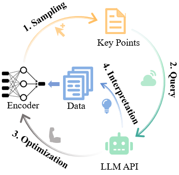
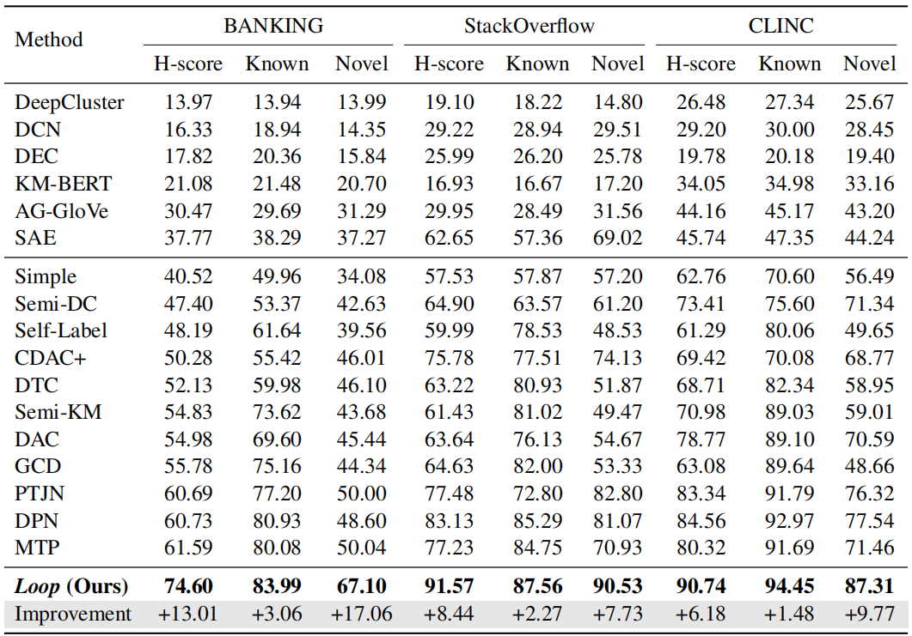

# GCD with LLMs in the Loop (LOOP)
Data and code for paper titled [Generalized Category Discovery with Large Language Models in the Loop](https://arxiv.org/abs/2312.10897) (ACL 2024 Findings paper)

*Generalized Category Discovery (GCD)* is a crucial task that aims to recognize both known and novel categories from a set of unlabeled data by utilizing a few labeled data with only known categories. Due to the lack of supervision and category information, current methods usually perform poorly on novel categories and struggle to reveal semantic meanings of the discovered clusters, which limits their applications in the real world. In this paper, we propose Loop, an end-to-end active-learning framework that introduces LLMs into the training loop, which can boost model performance and generate category names without relying on any human efforts.


## Contents
[1. Data](#data)

[2. Model](#model)

[3. Requirements](#requirements)

[4. Running](#running)

[5. Results](#results)

[6. Thanks](#thanks)

[6. Citation](#citation)

## Data
We performed experiments on three public datasets: [clinc](https://aclanthology.org/D19-1131/), [banking](https://aclanthology.org/2020.nlp4convai-1.5/) and [stackoverflow](https://aclanthology.org/W15-1509/), which have been included in our repository in the data folder ' ./data '.

## Model
An overview of our model is shown in the figure.
<div align=center>

</div>

## Requirements
* python==3.8
* pytorch==1.11.0
* transformers==4.15.0
* openai==0.28.0
* scipy==1.9.3
* numpy==1.23.5
* scikit-learn==1.2.0
* faiss-gpu==1.7.2

## Running
Pre-training, training and testing our model through the bash scripts:
```
sh run.sh
```
You can also add or change parameters in run.sh (More parameters are listed in init_parameter.py)

## Results
<div align=center>

</div>
It should be noted that the experimental results may be different because of the randomness of clustering when testing even though we fixed the random seeds.

## Thanks
Some code references the following repositories:
* [DPN](https://github.com/Lackel/DPN)
* [NID](https://github.com/fanolabs/NID_ACLARR2022)

## Citation
If our paper or code is helpful to you, please consider citing our paper:
```
@article{an2023generalized,
  title={Generalized Category Discovery with Large Language Models in the Loop},
  author={An, Wenbin and Shi, Wenkai and Tian, Feng and Lin, Haonan and Wang, QianYing and Wu, Yaqiang and Cai, Mingxiang and Wang, Luyan and Chen, Yan and Zhu, Haiping and others},
  journal={arXiv preprint arXiv:2312.10897},
  year={2023}
}
```
